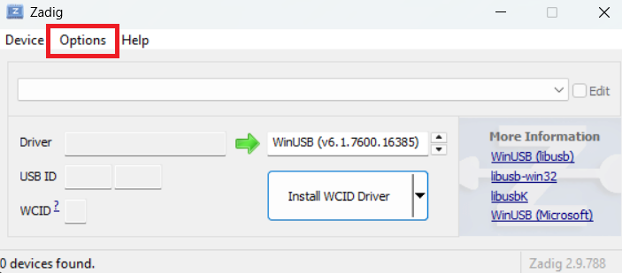
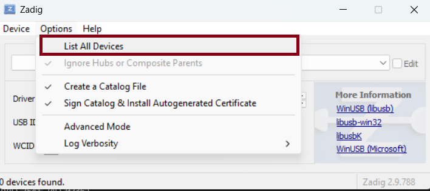
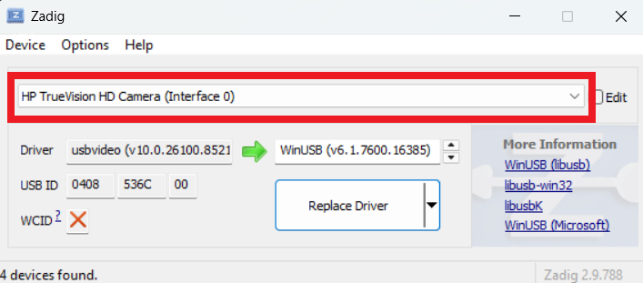
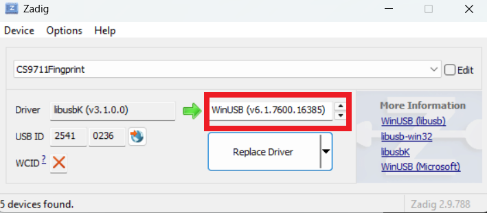
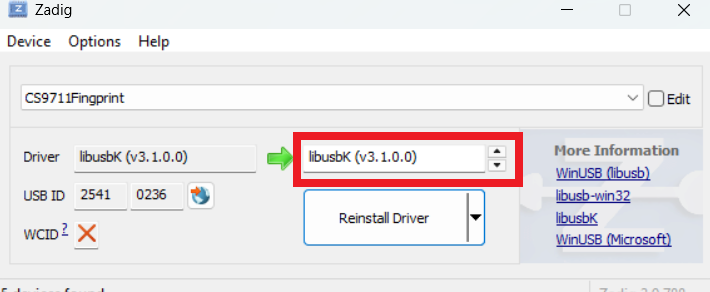

# FingerprintBridge

<table>
  <tr>
    <td>
      
    </td>
    <td valign="middle">
      <h1>HOW</h1>
      <h1>TO</h1>
      <h1>SETUP</h1>
    </td>
  </tr>
</table>

## Prerequisites
- Python 3.10+
- Administrator privileges

## 1. Driver Setup (First Time Only)
Windows blocks PyUSB by default. You must swap the default driver to `libusbK` to allow the backend to communicate with the hardware. Follow these steps carefully:

1. **Connect the Hardware**: Plug in the CS9711 scanner to an available USB port.
2. **Launch Zadig**: Navigate to the `drivers` folder in this project and run `zadig-2.9.exe`. **You must right-click and run as Administrator.**
3. **Show All Devices**: By default, Zadig hides devices that already have drivers. Click on **Options** in the top menu and check **List All Devices**.
  
   
   

4. **Select the Scanner**: In the main dropdown menu, look for and select **ChipSailing CS9711**.
   - *Verification*: Ensure the USB ID displayed matches `2541` (VID) and `0236` (PID).

   

5. **Choose the Target Driver**: On the right side of the green arrow, use the up/down arrows to select **libusbK**. Do NOT select WinUSB or libusb-win32.

   
   
   
6. **Apply Changes**: Click the large **Replace Driver** (or **Install Driver**) button. Wait for the installation to complete successfully.

## 2. Installation & Run
Open an **Administrator PowerShell** in the project root:

```powershell
cd backend
pip install -r requirements.txt
uvicorn main:app --reload
```

## 3. Usage
The API is now running at `http://localhost:8000`.

## Manual Tests
After running the server, you can test the API using the following commands:

- **Check Status**: `GET http://localhost:8000/`
- **Capture Fingerprint**: `POST http://localhost:8000/capture`
- **List Scans**: `GET http://localhost:8000/scans`

Example commands:
```powershell
# Check Status
Invoke-RestMethod -Uri http://localhost:8000/

# Capture Fingerprint
Invoke-RestMethod -Uri http://localhost:8000/capture -Method Post

# List Scans
Invoke-RestMethod -Uri http://localhost:8000/scans
```

## Troubleshooting
- **`Access denied`**: You didn't run PowerShell as Administrator.
- **`usb.core.NoBackendError`**: `libusb-1.0.dll` is missing from the `backend/` folder.
- **`CS9711 not found`**: Scanner isn't plugged in, or you didn't swap the driver to libusbK.

## STILL NOT WORKING ASK CHATGPT LOL!!!
